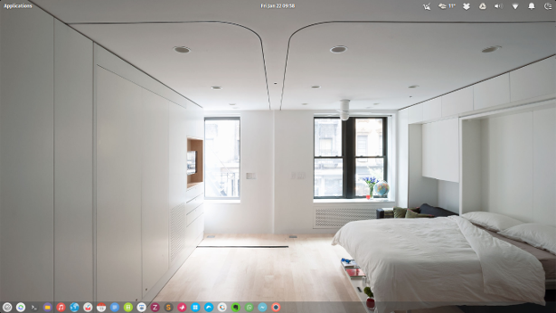

#Alpaca - Plank Theme for Elementary OS Freya
Christian Danne (dannec@tcd.ie)  

Version: Jan 22 2016  

###Description
Transparent theme for Elementary OS Freya's Plank (see screenshot below). 



###Installation instructions
To install the theme, download the folder and extract `Alpaca.tar.gz`. Either use the command line or run

```bash
sudo pantheon-files
```

and copy the extracted folder to /usr/share/plank/themes/. 

Use [Elementary Tweaks](https://launchpad.net/elementary-tweaks), if installed, to change the Plank theme to Alpaca. Or run

```bash
plank --preferences
```
to open the Plank settings dialog. 

 
 

 
 


 


   
    